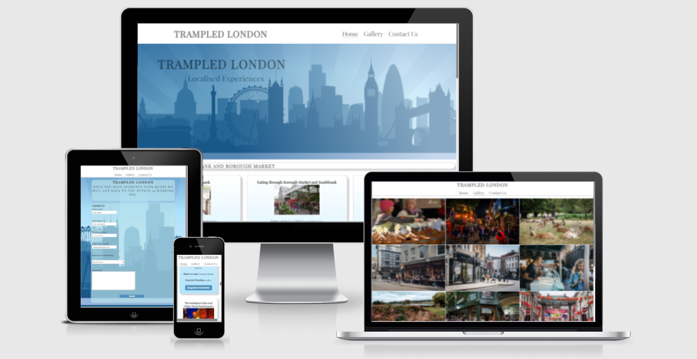
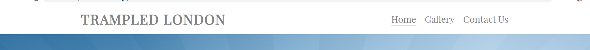
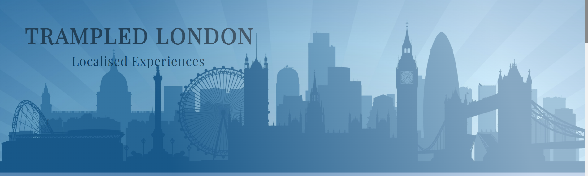
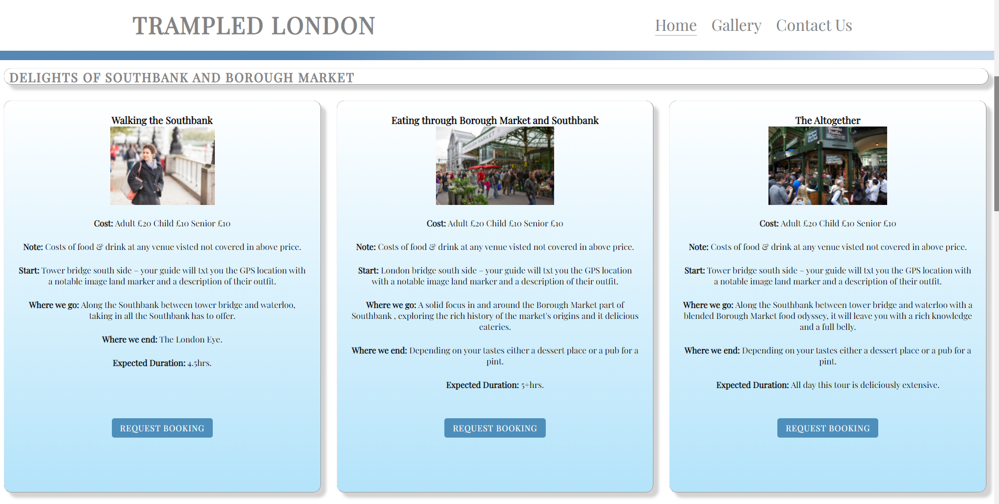
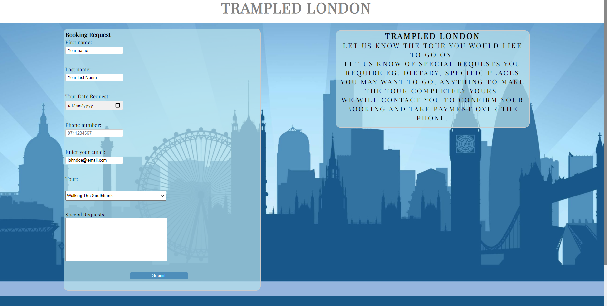
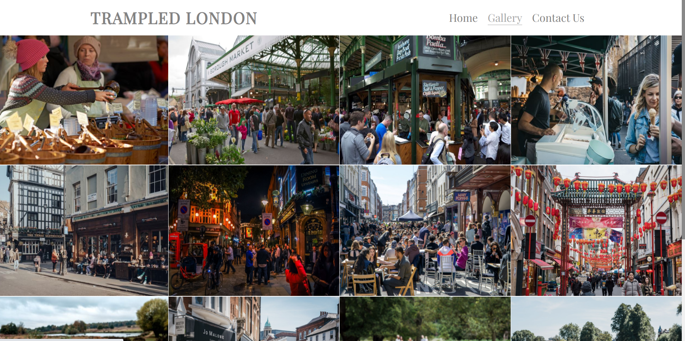
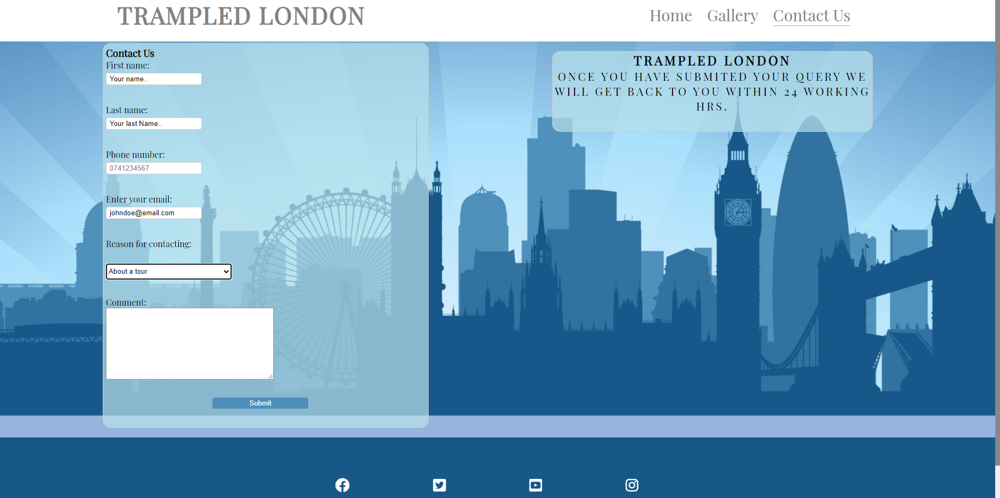
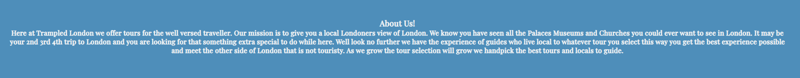
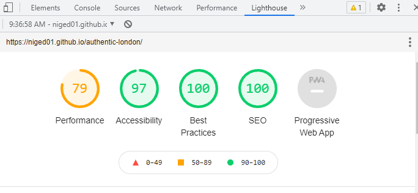

### Trampled London
-------
Trampled London is a site for a walking tours hub that aims to give the user a very local experience by using guides who live in and local to the area of the tour. This is to give the user the best unique experience to each tour area, the guides knowledge from being a local creates an experience that is uniquely immersive. 

The objective is to provide tours that go off the tourist trail, we leave behind all the big tourist regulars people are accustom to and enter into the cultural heart and soul of London exploring the otherwise unseen parts. 

These tours are aimed at tourists who have been to London before and are looking for things to do away from the main tourist hot spots, they are also aimed at Londoners who want to explore more of their home and new residents alike.

---------
## Features

### Existing Features

* Navigation Bar
    * The navigation bar features logo all 3 pages and links all active, user can press logo on any page and it will return them to the home screen.
    * This navigation bar gives the user a simple click between pages so they aren't having to use the back button constantly.

    

* Hero Image
    * On landing into the site users are met with an illustration of the iconic London skyline the company logo and slogan.
    * The user is met with a clear picture of where it is they will be and is intended to evoke a pleasent feeling within them while giving them a clear direction.

    

* The Tours
    * As this is a new start up the tours offered a limited for a period of time to 3 distinct areas of London. These area's were picked as both personal favourites to myself and to cater to different clientele such as soho for those who love a night out, Richmond park for the outdoorsy people and southbank for the foodies out there along with the arty people for diverse galleries and street performers etc that mosey along the southbank.
    * The user is met with 3 disctinct tour areas with 3 tours and their descriptions with a request booking button taking the user to a booking request page. They also all include an image from the area each tour is. Note: I have made this a booking request only at this stage as I do not yet have the know how to implement the ecommerce side of things and for this project purpose the site is static. The form data does not go anywhere at this point due to the website being static.

    
    

* The Gallery 
    * This is a collection of images dedicated to the 3 tour group areas layed out in the order the tours on the main page are layed out Southbank, Soho & Richmond.
    * This gallery is designed to give a glimps of what a tour will look like and let the user imagine themselves enjoying it all.

    

* Contact us
    * This form has been designed specifically for feedback, enquiry & to join Trampled London as a guide. 
    * The user is able to interact with the company as we are a new company this is vital to the growth.
    * The form data does not go anywhere at this point due to the website being static.

  

* About us
    * This has been designed to give the user an exact description of who we are where we are at and our intended path.

    

* Footer
    * Footer inludes links to social media sites. Note: links take user to sign in pages of social sites

    

* Color Pallet
    * The color pallet has been selected from the the hero image on the landing page. The dark to warm blue's in a pastle approach.
    * The color pallet has been kept throughout the enitre project for consitancy but also to distinctfully remind the user that they are on the Trampled London site. It is for this reason the both Booking request and contact us have the Hero image as their background image.

---------

## Testing

### Validator Testing

* HTML
    * No Errors were returned when passing through the offical [W3C validator](https://validator.w3.org/nu/?doc=https%3A%2F%2Fniged01.github.io%2Fauthentic-london%2F)

* CSS
    * No Errors were returned when passing through the offical [(jigsaw) validator](https://jigsaw.w3.org/css-validator/validator)

### Acessibility

* When running the acessibility test through lighthouse  the test itself came back with a 97% which is great however the performance returned a 79% this is from images to I did resized the larger images however all the images are required for the site so I have kept them in.

    

----------
## Deployment

* This site was deployed using GitHub pages via the following steps.
    * In github repository, go to settings tab.
    * From the options bar on the left select pages tab.
    * Once in pages select the branch and choose main.
    * Refresh the page and the site will be published.

* The live link can be found here - https://niged01.github.io/authentic-london/

------------

## Credits

### Content

##### Note the below I referenced as guides ultimately I tweaked the code to fit the design I invisoned.

* The responsive header was taken from a youtube tutorial https://www.youtube.com/watch?v=mh36Kts-wX8
* The grid layout was taken from this youtube tutorial https://www.youtube.com/watch?v=ZAY9ROkyPAU&t=1688s
* I referenced the the Love running project for insperation on the direction the site was taking https://github.com/Niged01/Love-Running. 
* To create the forms I took elements of form creation from this tutorial https://www.youtube.com/watch?v=8yrTnjo0TWw. But as I wanted the forms to be posiitoned using flex I did not use fieldset or legend and replaced these with a DIV. 
* To create the linear gradient I used https://www.w3schools.com/css/tryit.asp?filename=trycss3_gradient-linear_trans
* To creat animated buttons I used https://www.w3schools.com/howto/tryit.asp?filename=tryhow_css_buttons_animate3
* To get a better understanding of flex box i used https://css-tricks.com/snippets/css/a-guide-to-flexbox/
* To create the custom scroll bar I used https://www.w3schools.com/howto/howto_css_custom_scrollbar.asp
* To understand how to create box shadow I used https://www.w3schools.com/cssref/css3_pr_box-shadow.asp 
* The icons in the footer were taken from https://fontawesome.com/

### Media 

* The hero image and all other images were obtained from:
     * Deposit photos - https://depositphotos.com/
     * Shuttersotck - https://www.shutterstock.com/

------------

## Ideas not implimented

* I wanted the tour boxes to collapse to only show image thumnail, when clicked on the box expands to reveal the content. However I was having difficulty with the box expanding it pushed the rest of the page content down which is not what I was ideally looking for. I have left the boxes at full view until I gain the skills to produce this.

* setting up the site in a way where people who want to join tours of their neighbourhood and earn money from it. I have not yet done this as this will require maps and other skills I have not yet obtained. 