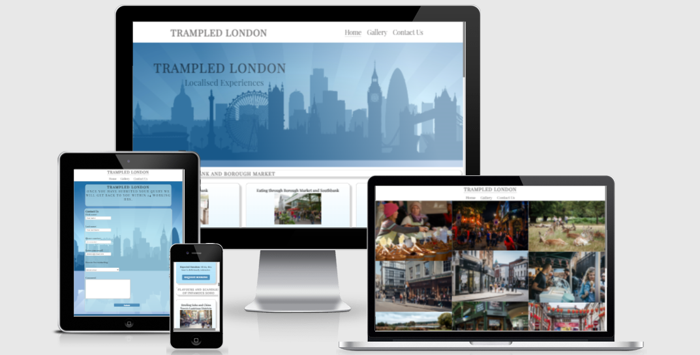

### Authentic London
-------
Authentic London is a site for a walking tour company that aims to give the user a very local experience by using guides who live in and local to the area of the tour. This is to give the user the best unique experience to each tour area, the guides knowledge from being a local creates an experience that is uniquely immersive. 

The objective is to provide tours that go off the tourist trail, we leave behind all the big tourist regulars people are accustom to and enter into the cultural heart and soul of London exploring the otherwise unseen parts. 

These tours are aimed at tourists who have been to London before and are looking for things to do away from the main tourist hot spots, they are also aimed at Londoners who want to explore more of their home and new residents alike.

## Features
--------

### Existing Features

* Navigation Bar
    * The navigation bar features logo all 3 pages and links all active, user can press logo on any page and it will return them to the home screen.
    * This navigation bar gives the user a simple click between pages so they aren't having to use the back button constantly.

    (insert nav bar image here!)

* Hero Image
    * On landing into the site users are met with an illustration of the iconic London skyline the company logo and slogan.
    * The user is met with a clear picture of where it is they will be and is intended to evoke a pleasent feeling within them while giving them a clear direction.

    (insert hero image here!)

* The Tours
    * As this is a new start up the tours offered a limited for a period of time to 3 distinct areas of London. These area's were picked as both personal favourites to myself and to cater to different clientele such as soho for those who love a night out, Richmond park for the outdoorsy people and southbank for the foodies out there along with the arty people for diverse galleries and street performers etc that mosey along the southbank.
    * The user is met with 3 disctinct tour areas with 3 tours and their descriptions with a request booking button taking the user to a booking request page. They also all include an image from the area each tour is. Note: I have made this a booking request only at this stage as I do not yet have the know how to implement the ecommerce side of things and for this project purpose the site is static.

    (insert tour shot and booking request screen shot)

* The Gallery 
    * This is a collection of images dedicated to the 3 tour group areas layed out in the order the tours on the main page are layed out Southbank, Soho & Richmond.
    * This gallery is designed to give a glimps of what a tour will look like and let the user imagine themselves enjoying it all.

    (insert screen shot of gallery)

* Contact us
    * This form has been designed specifically for feedback, enquiry & to join Trampled London as a guide. 
    * The user is able to interact with the company as we are a new company this is vital to the growth.

  (insert screen shot of contact us)

* About us
    * This has been designed to give the user an exact description of who we are where we are at and our intended path.

    (insert screen shot of about us)

* Footer
    * Footer inludes links to social media sites. Note: links take user to sign in pages of social sites

    (insert image of footer)

* Color Pallet
    * The color pallet has been selected from the the hero image on the landing page. The dark to warm blue's in a pastle approach.
    * The color pallet has been kept throughout the enitre project for consitancy but also to distinctfully remind the user that they are on the Trampled London site. It is for this reason the both Booking request and contact us have the Hero image as their background image.

## Teasting

----------
